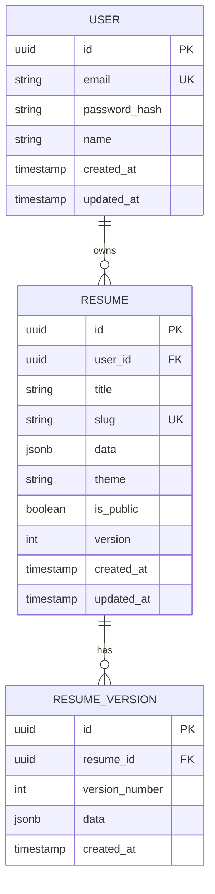

# Vitae

A RESTful API service for managing, storing, and serving developer resumes. Built on the JSON Resume standard with authentication, PDF export, theming, and public sharing.

---

## Proposed Stack

| Layer | Technology | Why |
|---|---|---|
| Runtime | **Python 3.12** | Strong ecosystem, demonstrates Python backend skills |
| Framework | **FastAPI** | Async, auto-generates OpenAPI/Swagger docs, type-safe with Pydantic |
| Database | **PostgreSQL** | Relational + JSONB for resume data |
| ORM | **SQLAlchemy 2.0** + Alembic | Async support, migrations |
| Auth | **JWT** (python-jose) + bcrypt (passlib) | Stateless auth, refresh tokens |
| Validation | **Pydantic v2** | Schema validation built into FastAPI |
| PDF Export | **WeasyPrint** | HTML/CSS to PDF, no headless browser needed |
| Rate Limiting | **slowapi** | Built on limits library, FastAPI-compatible |
| Testing | **pytest** + httpx | Async test client for FastAPI |
| Containerization | **Docker** | Consistent deployment |
| CI/CD | **GitHub Actions** | Automated tests + deploy |

---

## Data Model



---

## API Endpoints

### Auth
| Method | Endpoint | Description |
|---|---|---|
| POST | `/api/auth/register` | Create account |
| POST | `/api/auth/login` | Get JWT tokens |
| POST | `/api/auth/refresh` | Refresh access token |
| GET | `/api/auth/me` | Get current user |

### Resumes (authenticated)
| Method | Endpoint | Description |
|---|---|---|
| GET | `/api/resumes` | List user's resumes |
| POST | `/api/resumes` | Create new resume |
| GET | `/api/resumes/{id}` | Get resume by ID |
| PUT | `/api/resumes/{id}` | Update resume (creates new version) |
| DELETE | `/api/resumes/{id}` | Delete resume |
| GET | `/api/resumes/{id}/versions` | List version history |
| GET | `/api/resumes/{id}/versions/{version}` | Get specific version |
| PATCH | `/api/resumes/{id}/settings` | Update theme, visibility, slug |

### Export (authenticated)
| Method | Endpoint | Description |
|---|---|---|
| GET | `/api/resumes/{id}/export/json` | Export as JSON Resume |
| GET | `/api/resumes/{id}/export/html` | Export as themed HTML |
| GET | `/api/resumes/{id}/export/pdf` | Export as PDF |

### Public (no auth, rate-limited)
| Method | Endpoint | Description |
|---|---|---|
| GET | `/r/{slug}` | View public resume (HTML) |
| GET | `/r/{slug}.json` | Get public resume (JSON) |
| GET | `/r/{slug}.pdf` | Download public resume (PDF) |

---

## Project Structure

```
vitae/
├── app/
│   ├── __init__.py
│   ├── main.py              # FastAPI app, middleware, routers
│   ├── config.py            # Settings (pydantic-settings)
│   ├── database.py          # SQLAlchemy engine + session
│   ├── models/              # SQLAlchemy models
│   │   ├── __init__.py
│   │   ├── user.py
│   │   ├── resume.py
│   │   └── resume_version.py
│   ├── schemas/             # Pydantic schemas
│   │   ├── __init__.py
│   │   ├── auth.py
│   │   ├── resume.py
│   │   └── json_resume.py   # JSON Resume standard schema
│   ├── routers/             # API route handlers
│   │   ├── __init__.py
│   │   ├── auth.py
│   │   ├── resumes.py
│   │   ├── export.py
│   │   └── public.py
│   ├── services/            # Business logic
│   │   ├── __init__.py
│   │   ├── auth.py
│   │   ├── resume.py
│   │   └── export.py
│   ├── middleware/          # Auth, rate limiting
│   │   ├── __init__.py
│   │   └── auth.py
│   ├── templates/           # Jinja2 HTML resume themes
│   │   ├── classic.html
│   │   └── modern.html
│   └── utils/
│       ├── __init__.py
│       └── slug.py
├── alembic/                 # Database migrations
│   ├── versions/
│   └── env.py
├── tests/
│   ├── conftest.py          # Fixtures (test DB, client, auth)
│   ├── test_auth.py
│   ├── test_resumes.py
│   └── test_export.py
├── docs/
│   └── PLAN.md
├── alembic.ini
├── docker-compose.yml
├── Dockerfile
├── pyproject.toml
├── requirements.txt
└── README.md
```

---

## Implementation Plan

### Phase 1 — Project Setup + Database
- [ ] 1a: Scaffold FastAPI project with pyproject.toml
- [ ] 1b: Configure PostgreSQL + SQLAlchemy async engine
- [ ] 1c: Define User, Resume, ResumeVersion models
- [ ] 1d: Set up Alembic migrations
- [ ] 1e: Docker Compose (app + postgres)
- [ ] `chore: scaffold fastapi project with postgres and docker`

### Phase 2 — Authentication
- [ ] 2a: Pydantic schemas for register/login/token
- [ ] 2b: Auth service (hash password, verify, create JWT)
- [ ] 2c: Auth router (register, login, refresh, me)
- [ ] 2d: JWT dependency for protected routes
- [ ] 2e: Tests for auth flow
- [ ] `feat: implement jwt authentication`

### Phase 3 — Resume CRUD + Versioning
- [ ] 3a: JSON Resume Pydantic schema (full spec validation)
- [ ] 3b: Resume service (create, read, update, delete, list)
- [ ] 3c: Auto-versioning on update (save snapshot to resume_versions)
- [ ] 3d: Resume router with all CRUD endpoints
- [ ] 3e: Slug generation + settings endpoint (theme, visibility)
- [ ] 3f: Tests for resume CRUD
- [ ] `feat: implement resume crud with versioning`

### Phase 4 — Export + Public URLs
- [ ] 4a: Jinja2 HTML templates (classic + modern themes)
- [ ] 4b: Export service (render HTML, generate PDF via WeasyPrint)
- [ ] 4c: Export router (json, html, pdf)
- [ ] 4d: Public router (/r/{slug}, /r/{slug}.json, /r/{slug}.pdf)
- [ ] 4e: Rate limiting on public endpoints
- [ ] 4f: Tests for export + public routes
- [ ] `feat: add export (json/html/pdf) and public sharing`

### Phase 5 — Docs + Polish
- [ ] 5a: OpenAPI metadata (title, description, tags, examples)
- [ ] 5b: Seed script with sample resume data
- [ ] 5c: README with usage examples and curl commands
- [ ] 5d: Error handling refinement (consistent error responses)
- [ ] `docs: add api documentation and seed data`

### Phase 6 — Deploy
- [ ] 6a: Multi-stage Dockerfile
- [ ] 6b: Deploy to Railway/Render (free tier)
- [ ] 6c: Update portfolio project card
- [ ] 6d: Screenshots of Swagger UI for portfolio
- [ ] `chore: deploy to production`

---

## Differentiators

| Feature | JSON Resume Registry | Reactive Resume | **Vitae** |
|---|---|---|---|
| REST API | ❌ (Gist-based) | ❌ (UI only) | ✅ Full CRUD |
| Self-hostable | ❌ | ✅ | ✅ |
| Version history | ❌ | ❌ | ✅ |
| PDF export via API | ❌ | ✅ (UI) | ✅ (API) |
| Public sharing URL | ✅ (Gist) | ✅ | ✅ (custom slug) |
| Swagger docs | ❌ | ❌ | ✅ (auto-generated) |
| JSON Resume standard | ✅ | Partial | ✅ |
| Auth + multi-user | ❌ | ✅ | ✅ |
| Themes via API | ❌ | ✅ (UI) | ✅ |
| Python/FastAPI | ❌ | ❌ | ✅ |
